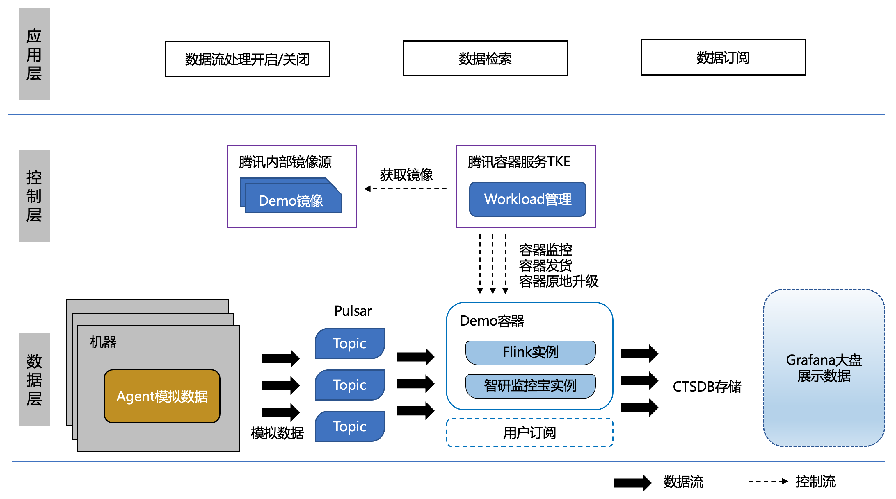
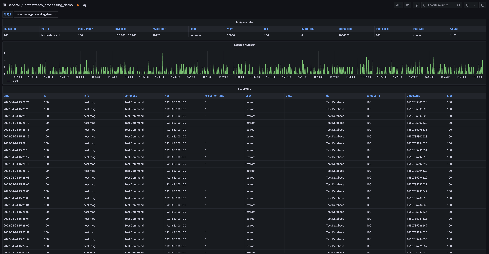
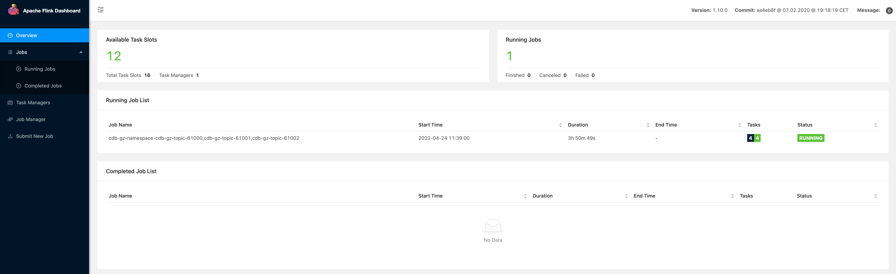
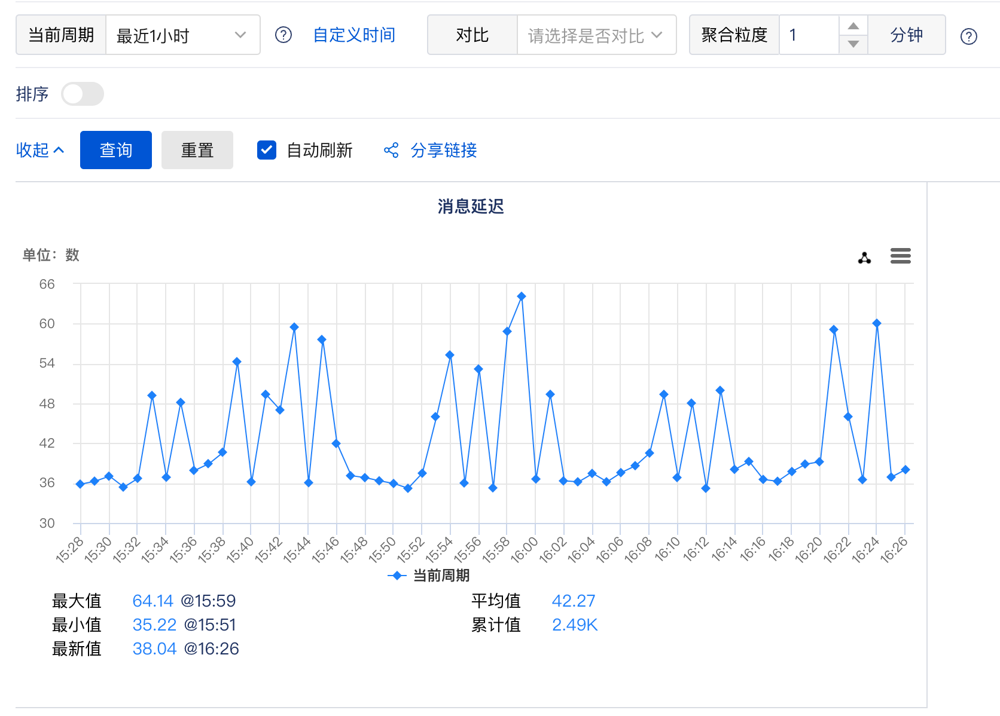
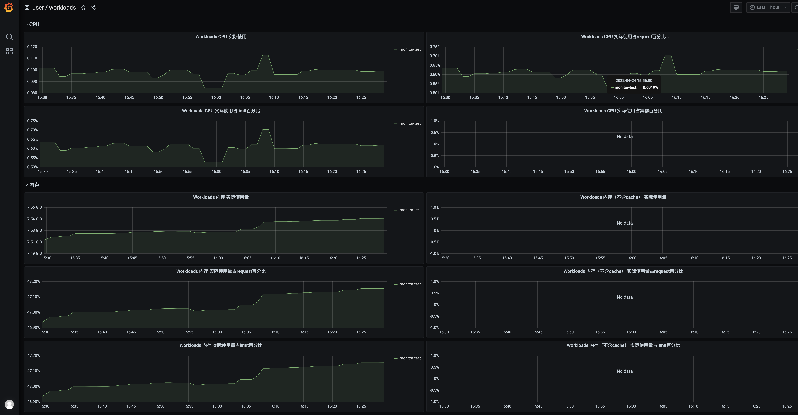

# datastream-processing-demo

## 简介

这是在腾讯容器服务TKE上部署数据流处理服务的Demo。

涉及组件：腾讯容器服务TKE、消息队列Pulsar、流处理Flink、时序数据库CTSDB、智研监控宝、可视化Grafana

## Demo架构图

## 时效性和可靠性优化

### 时效性

1. 延迟检测与告警：flink在进行数据分流时会检测延迟，并上报到智研监控宝；监控宝可设置延迟的阈值告警。
2. 提升流处理效率：提升flink任务的计算效率（例如尽量少做json解析等需要大量消耗CPU资源的计算）、减少不同流之间的计算耦合
3. 提升flink集群硬件水平、调整flink设置参数
4. 保证消息队列和数据库链路通畅

### 可靠性

1. 数据生产端：存活心跳检测、上报失败策略、同城/异地容灾、持久化策略、数据落库检测、数据有序实现
2. 消息队列Pulsar：容灾策略、数据持久化存储、多副本
3. 流处理flink：多集群多JobManager选主、Source模块的ACK策略、异常告警
4. 数据库CTSDB：数据落库检测、多副本存储
5. 腾讯容器服务TKE：容器监控、容器异常告警

## 代码结构

- **flink文件夹**

  - run_datastream_job.sh flink流处理任务启动脚本
- **datastream-processing-main文件夹** 流处理主程序

  - DataStreamProcessingJob.java 将Pulsar获取的数据分流到CTSDB和智研监控宝中
  - build-all.sh 依次编译所有包
- **flink-connector-pulsar文件夹** flink连接pulsar

  - PulsarSource.java 从Pulsar获取数据
- **flink-connector-zhiyan文件夹** flink连接智研宝

  - ZhiYanSink.java 将数据发送到直言监控宝
- **flink-connector-ctsdb文件夹** flink连接CTSDB

  - CTSDBSink.java 将数据发送到CTSDB

## 结果展示

### 数据页面展示

### 容器内flink

### 智研监控宝的流处理延迟检测

### 腾讯容器服务TKE的容器监控

